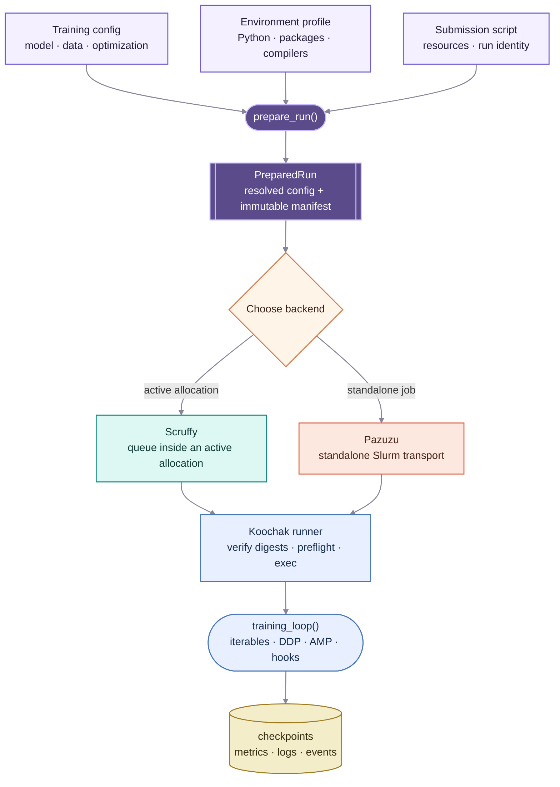
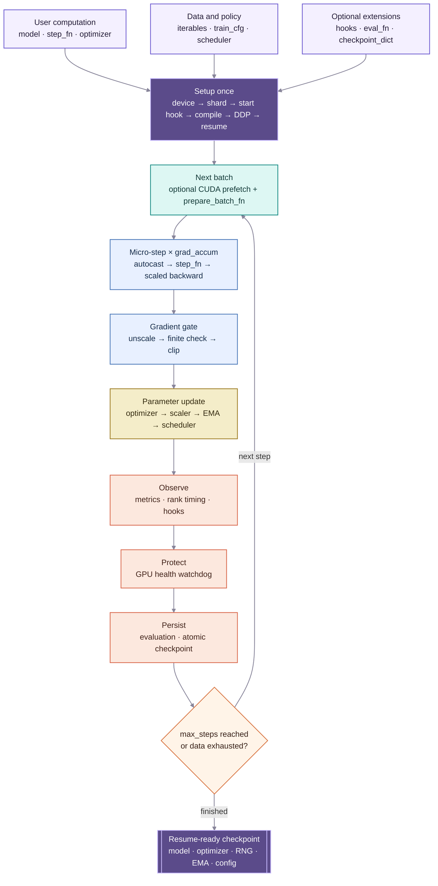

# Koochak

A tiny, hackable, function‑first training loop for PyTorch. Built to be easy to read, fork, and extend. It favors explicit functions and small modules over opaque classes or global state.

## Related Projects

Koochak prepares reproducible workloads; it deliberately does not own cluster
connectivity or GPU scheduling. It integrates with two small, independent
projects:

- [Scruffy](https://github.com/jamaliki/scruffy) is an asynchronous resource
  scheduler for jobs running inside an existing multi-node allocation. It owns
  GPU reservations, dependencies, fair queueing, lifecycle state, and the event
  stream used by agents and dashboards.
- [Pazuzu](https://github.com/jamaliki/pazuzu) is a resilient, site-neutral
  OpenSSH gateway with a typed Slurm client. It owns remote transport and is the
  backend for standalone Slurm jobs when no suitable Scruffy allocation is
  available.

The boundary is intentional: Koochak defines exactly *what* runs, Scruffy
decides *where and when* it runs inside an allocation, and Pazuzu carries
commands safely to a remote cluster.

## Architecture at a Glance

### From Experiment to Execution



The backend choice does not alter the prepared workload. Both paths invoke the
same runner, which rejects configuration or environment drift before importing
training code. Once admitted, `training_loop()` remains the small functional
core; checkpointing, logging, distributed execution, and workload events attach
through focused helpers and hooks.

### Inside `training_loop()`



The user-defined `step_fn` owns model semantics and returns a loss plus optional
metrics. Koochak owns the repetitive mechanics around it. Optional behavior is
composed through functions and event hooks rather than subclasses, while the
returned checkpoint captures everything required to resume the optimization
state deterministically.

## Goals

- Functional core: a single `training_loop(...)` with a clear, compact signature.
- Hackable: pure-PyTorch, minimal magic, everything explicit via a small config mapping.
- Iterable-first: data is any iterable (finite or infinite). No hidden epoch semantics.
- Modern essentials: AMP, grad accumulation, grad clipping, logging, checkpointing, eval hooks, and DDP, each in small swappable modules.
- Low dependency: standard library + PyTorch (OmegaConf for configs; optional: torchvision for examples, tqdm for niceties, wandb for logging).

## Repository Layout

- `koochak/`
  - `loop.py` – the core `training_loop` implementation (imports tiny helpers; loop remains minimal).
  - `config.py` – OmegaConf + dataclass config loader, defaults, and summary helpers.
  - `core/`
    - `hooks.py` – tiny hook system: `merge/add/emit` and `rank0_only` wrapper.
    - `precision.py` – `autocast_context(mode, device)` and `Scaler(mode)`.
    - `dist.py` – DDP helpers: `init_process_group`, `barrier`, `rank/world_size`, `rank0`.
  - `data/`
    - `iterable.py` – `to_device(batch, device)`, `cycle(iterable)`, and `take(iterable, n)`.
    - `sharding.py` – `shard_dataset(..., mode=...)`, `shard_iterable_dataset`, `shard_map_dataset`.
  - `logging/`
    - `stdout.py` – compact TSV stdout logger + `make_stdout_hooks()`.
    - `csv.py` – `CSVLogger` and `make_csv_hooks(path)`.
    - `jsonl.py` – `JSONLLogger` and `make_jsonl_hooks(path)`.
    - `events.py` – bounded lifecycle/progress hooks and an optional lazy Scruffy adapter.
    - `wandb_logger.py` – optional W&B hooks (lazy import), artifact upload.
  - `jobs/`
    - `profile.py` – strict, reusable execution-environment profiles.
    - `manifest.py` – deterministic config materialization and immutable launch manifests.
    - `runner.py` – clean-environment checks followed by an exact Python `execve`.
    - `backends.py` – thin Python adapters for Pazuzu and Scruffy.
  - `optim/`
    - `build.py` – tiny builders for optimizers/schedulers (supports cosine, step, plateau, cosine_warmup).
  - `storage/`
    - `checkpoint.py` – checkpoint save/load (atomic), `latest`, `best`.
    - `atomic.py` – atomic file writer.
    - `fs.py` – small FS utilities (`mkdir_p`, `latest`, `best`).
    - `pruning.py` – `prune_keep_last_k(dir, pattern, k)`.
  - `utils/`
    - `config.py` – thin compatibility wrappers around `koochak.config` (`get/as_dict`).
    - `device.py` – `get_device(cfg)` and `get_lr(optimizer)`.
    - `seed.py` – `set_all_seeds(seed)`, `make_worker_init_fn(seed)`, `get_rng_state()`.
    - `stats.py` – `SmoothedMeter`, `Throughput`, `EMA`.
    - `timeit.py` – `Timer` and `time_block(...)` context utilities.
- `examples/mnist/`
  - `config.yaml` – YAML-driven config split into `train`, `data`, `optim`, `logging`, `wandb` sections.
  - `main.py` – minimal end-to-end example (YAML-only CLI), stdout hooks by default, optional W&B.
- `examples/config_template.yaml` – canonical template with all supported keys.
- `AGENTS.md` – running design notes + TODOs for contributors.

## Installation

- Python 3.10+
- PyTorch (CUDA optional): https://pytorch.org
- Required: `pip install omegaconf`
- Optional: `pip install torchvision wandb tqdm`

This repo is intentionally lightweight: it is not a packaged PyPI install. Import modules via the repo root (e.g., `python -m examples.mnist.main`).

## Quickstart (MNIST)

1) Configure YAML (defaults provided):

`examples/mnist/config.yaml`

- `train`: loop behavior (max_steps, log/eval/ckpt cadence, grad_accum, amp, seed, device, out_dir, keep_last_k, ddp flag).
- `data`: `data_dir`, `batch_size`, `num_workers`.
- `optim`: optimizer + scheduler (e.g., AdamW + cosine_warmup).
- `logging`: `csv_path`, `jsonl_path`.
- `wandb`: set `enabled: true` to turn on W&B logging.

2) Run:

`python -m examples.mnist.main --config examples/mnist/config.yaml`

This will download MNIST (via torchvision), print TSV logs to stdout, periodically evaluate, and write atomic checkpoints to `train.out_dir` (e.g., `./runs/mnist/step000000000.pt` and `latest.pt`).


## Configuration

Configs are OmegaConf-first with structured dataclass defaults. Defaults fill missing keys, user YAML overrides defaults, and CLI overrides (if any) apply last.
Use OmegaConf interpolation for cross-section reuse (e.g., `logging.csv_path: ${train.out_dir}/log.csv`).

By default, Koochak enforces strict configuration to minimize surprises.

- Strict mode: unknown YAML keys cause an immediate error before training. To relax, set `train.strict_config: false`.
- Warnings: if strict is disabled, unknown keys print rank-0 warnings when `train.config_warn_unknown: true` (default true).

Example YAML toggles:

```
train:
  strict_config: true       # default
  config_warn_unknown: true # default, applies when strict_config=false
```

At startup, a brief config summary prints sections present, unknown keys (if any), and strict status.

Canonical template: `examples/config_template.yaml`.

In code, use `koochak.config.load_config(path)` and `koochak.config.get_section(cfg, "train")` (or similar) to access sections.

DDP sharding is explicit and opt-in:

- `train.shard_dataset: true` with `train.shard_dataset_mode: iterable|map` to shard the training dataset.
- `train.shard_eval_dataset: true` with `train.shard_eval_dataset_mode: iterable|map` to shard the eval dataset.
- `train.warn_unsharded: false` to disable rank-0 warnings when DDP runs without Koochak sharding.

You can also shard manually in custom code via `koochak.data.sharding.shard_dataset(...)`.

## Config Map

- `train` – consumed by `koochak/loop.py` and utilities (device, DDP/sharding, logging cadence, checkpoints, EMA, AMP).
- `data` – consumed by examples or your dataset builders; use OmegaConf interpolation for shared values.
- `optim` – consumed by `koochak/optim/build.py` for optimizer + scheduler construction.
- `logging` – consumed by CLI/examples to configure stdout/CSV/JSONL hooks.
- `wandb` – consumed by `koochak/logging/wandb_logger.py`.
- `entry` – consumed by `koochak/cli/train.py` to import user callables.


## Generic CLI

Koochak ships a generic YAML-driven CLI so you can run training without custom scripts.

Run:

`python -m koochak.cli.train --config path/to/your_config.yaml`

Your YAML must include an `entry` section to locate user code, plus the standard sections:

```
entry:
  model: your_pkg.model_defs:make_model     # returns nn.Module
  dataset: your_pkg.data:train_dataset      # returns iterable (or DataLoader)
  step: your_pkg.train:step_fn              # def step_fn(model, batch, ctx) -> dict
  eval_dataset: your_pkg.data:val_dataset   # optional
  eval_fn: your_pkg.train:eval_fn           # optional

train: { ... }
data:  { ... }
optim: { optimizer: {...}, scheduler: {...} }
logging: { csv_path: ..., jsonl_path: ... }
wandb: { enabled: false, project: ... }
```

The CLI loads config via `koochak.config.load_config`, prints the summary, builds the optimizer/scheduler from `optim`, attaches stdout/CSV/JSONL/W&B hooks, resumes from the latest checkpoint under `train.out_dir`, and calls `training_loop` with `train_cfg`.

## Reproducible Job Submission

Koochak compiles a training config and an execution-environment profile into an
immutable launch manifest. [Scruffy](https://github.com/jamaliki/scruffy) can
enqueue that runner inside an active allocation, while
[Pazuzu](https://github.com/jamaliki/pazuzu) can stage and submit it as a
standalone Slurm job. Both use the same prepared run, so changing the backend
does not change its configuration or environment contract. Koochak contains no
hostnames, users, filesystem layout, scheduler defaults, or other site policy.

Environment profiles are strict YAML. They define an absolute Python,
deterministic `PATH`, explicit compiler paths, required files and package
versions, named secret inputs, cache directories, and built-in checks. Unknown
fields and OmegaConf environment interpolation are rejected. Secret values are
read only inside the worker and are never written to the profile or manifest.

```yaml
version: 1
id: project-gpu-v1
python: /shared/envs/project/bin/python
environment:
  set:
    PATH: /shared/toolchains/bin:/shared/envs/project/bin:/usr/bin:/bin
    CC: /shared/toolchains/bin/gcc
    CXX: /shared/toolchains/bin/g++
    TRITON_CACHE_DIR: "{run_dir}/triton-cache"
  secrets: [TRACKING_TOKEN]
  create_directories: ["{run_dir}/triton-cache"]
requirements:
  executables: [/shared/toolchains/bin/gcc, /shared/toolchains/bin/g++]
  files: []
  packages: {torch: "2.8.0", triton: "3.4.0"}
preflight: [c_compiler, cuda, torch_compile]
```

Prepare a run in a committed Python submission script:

```python
from koochak.jobs import ConfigPatch, load_environment_profile, prepare_run

prepared = prepare_run(
    name="smoke-len128",
    profile=load_environment_profile("environments/gpu.yaml"),
    python_args=["-m", "my_pkg.train", "--config", "{config}"],
    cwd="/shared/project/repo",
    run_dir="/shared/project/runs/smoke-len128",
    base_config="configs/train.yaml",
    patches=[ConfigPatch("data.max_length", 128)],
)
```

For a standalone Slurm job, pass backend-native resources to Pazuzu:

```python
from pazuzu import PazuzuClient, SlurmResources
from koochak.jobs import submit_pazuzu

handle = await submit_pazuzu(
    PazuzuClient(),
    prepared,
    resources=SlurmResources(
        nodes=1,
        gpus_per_node=1,
        cpus_per_task=14,
        memory_gb_per_node=128,
        time_limit="02:00:00",
    ),
    log_dir=f"{prepared.run_dir}/logs",
)
```

Inside a filesystem that can see a Scruffy queue and the run directory:

```python
from scruffy import ResourceRequest
from koochak.jobs import submit_scruffy

job = submit_scruffy(
    prepared,
    root="/shared/queues/allocation",
    resources=ResourceRequest(
        nodes=1,
        gpus_per_node=1,
        cpus_per_node=14,
        memory_gb_per_node=128,
        time_limit_seconds=7200,
    ),
    request_id="campaign/smoke/attempt-1",
    project_id="project",
)
```

The runner starts under `python -I`, reconstructs the environment from a small
allowlist, restores scheduler-owned `SLURM_*`, `SCRUFFY_*`, and GPU identity,
verifies manifest/config digests, performs the declared checks, writes
`preflight.json`, and only then uses `execve` to start user code. A missing C
compiler or failed Torch/Triton compilation therefore fails before model code
runs. Ordinary variables, including `NCCL_*`, must be explicit under `set`;
only fixed runtime identity and named secrets are inherited. See
`examples/jobs/` for complete site-neutral examples.


## Core API

`koochak/loop.py` exposes:

```
training_loop(
  *,
  model: nn.Module,
  dataset: Iterable,                 # any iterable (finite or infinite)
  step_fn: Callable,                 # returns {"loss": Tensor, ...}
  optimizer: Optimizer,
  scheduler: Optional[_LRScheduler] = None,
  train_cfg: Mapping[str, Any],
  config_json: Optional[Mapping[str, Any]] = None,
  checkpoint_dict: Optional[Dict[str, Any]] = None,
  eval_dataset: Optional[Iterable] = None,
  eval_fn: Optional[Callable] = None,
  hooks: Optional[Dict[str, list[Callable]]] = None,
) -> Dict[str, Any]
```

- `step_fn(model, batch, ctx)` returns `{"loss": Tensor, ...}`; any additional scalar values are logged.
- `ctx` contains `device`, `rank/world_size`, `autocast`, `scaler`, `config_json`, and `train_cfg`.
- The loop handles gradient accumulation, AMP, optional grad clipping, scheduler stepping (per `train.scheduler_step`), evaluation hooks, automatic DDP bootstrap/wrapping when `train.ddp` is true, and deterministic checkpointing.
- Rank-0 prints a compact parameter count banner at startup to highlight model size changes.
- Non-finite gradients are zeroed and skipped with a rank-0 warning instead of crashing the run.
- Returns a plain checkpoint dict sufficient to resume.

Minimal step_fn example:

```
def step_fn(model, batch, ctx):
    x, y = batch["x"], batch["y"]
    logits = model(x)
    loss = torch.nn.functional.cross_entropy(logits, y)
    acc = (logits.argmax(-1) == y).float().mean()
    return {"loss": loss, "acc": acc}
```

## Hooks and Logging

- Create hooks by event name: `{"on_log": [fn], "on_eval_end": [fn]}`.
- Hook events emitted by the loop include `on_train_start`, `on_step_end`, `on_log`, `on_eval_end`, `on_checkpoint`, `on_train_end`, and `on_exception`.
- Built-in hooks:
  - `koochak.logging.stdout.make_stdout_hooks()` – TSV prints; rank-0 only.
  - `koochak.logging.csv.make_csv_hooks(path)` – append metrics to CSV; rank-0 only.
  - `koochak.logging.jsonl.make_jsonl_hooks(path)` – one JSON per line; rank-0 only.
  - `koochak.logging.events.make_event_hooks(publish)` – rank-0
    `workload.phase`, `workload.progress`, `workload.milestone`, and
    `workload.artifact` events for an external coordinator. Training progress
    defaults to approximately one event every 30 seconds at completed-step
    boundaries and includes completed/total steps; evaluations and checkpoint
    references are always attempted. Payloads contain at most 32 finite scalar
    metrics and never include full resolved configs or checkpoint contents.
  - `koochak.logging.events.make_scruffy_hooks()` – requires `SCRUFFY_ROOT` and
    `SCRUFFY_JOB_ID`; Scruffy is imported lazily and is not a Koochak dependency.
  - `koochak.logging.wandb_logger.make_wandb_hooks(cfg)` – W&B logging/artifacts; rank-0 only.
- Stdout and W&B record the resolved config at `on_train_start`; CSV/JSONL
  remain metric logs.
- Compose hooks with `koochak.core.hooks.merge(a, b)`. Gate any custom hook via `koochak.core.hooks.rank0_only(fn)` to ensure single-emission under DDP.
- The generic `python -m koochak.cli.train` entrypoint automatically merges the
  Scruffy hooks when both worker variables are present. Publisher errors warn once
  and remain non-fatal; CSV, JSONL, W&B, and raw training logs remain the detailed
  telemetry sources.

YAML-driven logging (example):

```
logging:
  csv_path: ./runs/mnist/log.csv
  jsonl_path: ./runs/mnist/log.jsonl
wandb:
  enabled: false
```

If `csv_path`/`jsonl_path` are omitted, the MNIST example defaults to `<train.out_dir>/log.csv` and `<train.out_dir>/log.jsonl`.

W&B artifacts:
- The W&B hook versions checkpoints as a single artifact per run named `<prefix>-<run_id>` (default prefix `model`).
- Each upload includes aliases: `latest`, `step-<n>`, and when improved metrics are seen, `best` and `best-<metric>`.
- Config overrides (optional) under `wandb`:
  - `artifact_name_prefix` (str, default `model`)
  - `artifact_type` (str, default `model`)

## EMA Support

- Enable EMA by setting `train.ema.enabled: true` (or by providing `decay`/`profile` keys while `enabled` is unset). Nested config lives under `train.ema.*`; legacy flat keys (`ema_decay`, `ema_eval`, etc.) are still honored.
- Supported options: `decay`, `decay_init`, `warmup_steps`, `schedule` (`constant`, `linear`, `cosine`), `profile` (`constant`, `power`), `gamma`/`srel` for power-law schedules, `offload_to_cpu`, `pin_memory`, `update_every`, `compensate_update_every`, and `eval_with_ema` to run eval with shadow weights.
- Thinned EMA updates are decay-compensated by elapsed model steps. For example, `update_every: 1` uses `decay`, while `update_every: 2` uses `decay ** 2` on each EMA update. The `compensate_update_every` key is retained for config/checkpoint compatibility; compensated behavior is the implementation.
- Dual EMA tracking is available via `train.ema.dual.enabled` plus `gamma1/gamma2` or `srel1/srel2`; both shadows are saved and restored from checkpoints.
- For EDM2-style post-hoc EMA tuning, collect the two dual EMA states from multiple saved checkpoints and pass the flattened list to `koochak.utils.ema_posthoc.reconstruct_power_ema_state_dict(...)`. `reconstruct_dual_power_ema_state_dict(...)` remains the lightweight same-checkpoint two-shadow helper.
- EMA state is serialized alongside the model (and matches state-dict prefixes automatically) so resumes and manual loads stay seamless.

## Checkpointing

- `koochak.storage.checkpoint.save(ckpt, path, keep_last_k)` performs atomic writes, keeps only the last `k` step-checkpoints, and maintains `latest.pt`.
- `koochak.storage.checkpoint.load(path)` loads to CPU.
- `koochak.storage.checkpoint.latest(dir)` returns `latest.pt` if present or the most recent step checkpoint.
- `koochak.storage.checkpoint.best(dir, key)` selects the lowest metric across checkpoints.

DDP compatibility:
- The loop saves the underlying module weights when the model is wrapped in `DistributedDataParallel` (i.e., uses `model.module.state_dict()`), making checkpoints portable across single-GPU and DDP.
- When loading manually, use the provided helpers if your loading target differs in wrapping:
  - `from koochak.storage.checkpoint import match_state_dict_to_model`
  - `target = getattr(model, 'module', model)`
  - `target.load_state_dict(match_state_dict_to_model(target, ckpt['model']))`

## Resuming Across DDP/Single GPU

When moving between single-GPU and DDP runs, key prefixes can differ (`module.`). The loop saves the underlying module weights for portability, but if you’re loading manually, use the helpers:

````
from koochak.storage.checkpoint import load, match_state_dict_to_model

ckpt = load(path)
target = getattr(model, 'module', model)
state = match_state_dict_to_model(target, ckpt['model'])
target.load_state_dict(state)
````


Checkpoint dict fields include: `step`, `model`, `optimizer`, `scheduler` (optional), `scaler` (optional), `config`, RNG state, `wall_time`, and `metrics`.

## Distributed (DDP)

- When `train.ddp: true`, the loop auto-initializes the process group (if needed), pins the model to the local device, and wraps it in `torch.nn.parallel.DistributedDataParallel`. Pass `train.find_unused_parameters: true` if you need the corresponding DDP flag.
- Sharding is explicit: use `train.shard_dataset`/`train.shard_dataset_mode` (and the eval equivalents) or call `koochak.data.sharding.shard_dataset(...)` in custom code. If DDP is enabled and datasets are not marked as sharded, rank 0 emits a warning by default.
- If you prefer manual control, initialize ahead of time via `koochak.core.dist.init_process_group(...)`; the loop will detect the existing group and skip auto-init.
- Launch with torchrun as usual:

`torchrun --nproc_per_node=8 -m examples.mnist.ddp_main --config examples/mnist/config.yaml`

The DDP launcher:
- Calls `init_process_group(backend=...)` and sets the current CUDA device from `LOCAL_RANK`.
- Forces `train.ddp: true` and keeps other training settings from YAML.
- Uses the same logging configuration (stdout/CSV/JSONL and optional W&B).

## Optimizers and Schedulers

- `koochak.optim.build.build_optimizer(params, cfg)` supports `adamw`, `adam`, `sgd`.
- `koochak.optim.build.build_scheduler(optimizer, cfg, train_cfg)` supports `cosine`, `step`, `plateau`, and `cosine_warmup`.

Example YAML (snippets):

```
optim:
  optimizer:
    name: AdamW
    lr: 0.0003
    weight_decay: 0.01
  scheduler:
    name: cosine_warmup
    warmup_steps: 100
    T_max: null   # falls back to train.max_steps
    eta_min: 0.0
```

## Reproducibility

- `koochak.utils.seed.set_all_seeds(seed)` sets Python/NumPy/Torch seeds and (optionally) CUDA seeds.
- `koochak.utils.seed.make_worker_init_fn(seed)` seeds DataLoader workers deterministically.
- RNG state is stored in checkpoints (`get_rng_state()`), so resumed runs continue deterministically.
- On resume, the training loop restores RNG state from the checkpoint (Python/NumPy/Torch CPU/CUDA) before resuming steps, so randomness inside `step_fn` (e.g., `torch.rand`) is reproducible across restarts.
- In DDP, prefer per-rank seeding (e.g., `set_all_seeds(seed + rank)`) and rank-aware worker seeding (`make_worker_init_fn(seed, rank=rank)`) to avoid correlated randomness. Checkpoints saved on rank 0 include per-rank RNG states and are used on resume to restore each rank’s RNG deterministically.

## Contributing

- Start with `README.md` and skim `design_doc.md` to understand the philosophy.
- See `AGENTS.md` for current implementation notes and a living TODO list. Keep it up to date as you work.
- Code style: clear, minimal, single-purpose modules. Favor functions and plain dicts over classes.

## Tests

Unit tests live under `tests/`. Use your preferred runner (e.g., `pytest`) from the repo root:

```
pip install pytest
pytest -q
```

## License

MIT (see `LICENSE`).
