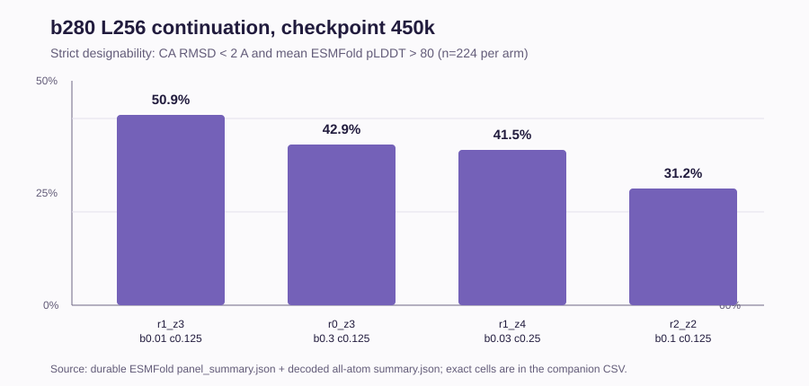

# b280 length-256 continuation: verified 450k foldability

## Result

This entry records the first verified foldability result from the lower-batch
length-256 continuation. The checkpoint is **450,000 steps**, with four arms,
seven lengths, and 32 samples per arm/length cell (896 samples total). The
strict endpoint is unchanged: **CA Kabsch RMSD < 2 A and mean ESMFold pLDDT >
80**.

| Arm | Designable | Mean pLDDT | Median CA RMSD (A) | Median corrected Atom14 RMSD (A) |
| --- | ---: | ---: | ---: | ---: |
| `r1_z3_b0p01_c0p125` | 114/224 (50.9%) | 79.25 | 1.336 | 1.696 |
| `r0_z3_b0p3_c0p125` | 96/224 (42.9%) | 75.00 | 1.568 | 1.864 |
| `r1_z4_b0p03_c0p25` | 93/224 (41.5%) | 73.33 | 1.544 | 1.844 |
| `r2_z2_b0p1_c0p125` | 70/224 (31.2%) | 69.31 | 2.297 | 2.773 |

## Length-resolved strict designability

| Arm | L64 | L96 | L128 | L160 | L192 | L224 | L256 |
| --- | ---: | ---: | ---: | ---: | ---: | ---: | ---: |
| `r1_z3_b0p01_c0p125` | 23/32 (71.9%) | 23/32 (71.9%) | 18/32 (56.2%) | 15/32 (46.9%) | 16/32 (50.0%) | 14/32 (43.8%) | 5/32 (15.6%) |
| `r0_z3_b0p3_c0p125` | 25/32 (78.1%) | 21/32 (65.6%) | 19/32 (59.4%) | 9/32 (28.1%) | 9/32 (28.1%) | 8/32 (25.0%) | 5/32 (15.6%) |
| `r1_z4_b0p03_c0p25` | 23/32 (71.9%) | 17/32 (53.1%) | 18/32 (56.2%) | 18/32 (56.2%) | 11/32 (34.4%) | 4/32 (12.5%) | 2/32 (6.2%) |
| `r2_z2_b0p1_c0p125` | 24/32 (75.0%) | 18/32 (56.2%) | 8/32 (25.0%) | 4/32 (12.5%) | 9/32 (28.1%) | 5/32 (15.6%) | 2/32 (6.2%) |

The exact cell-level metrics, including pLDDT pass rate, CA RMSD pass rate,
and mean/median corrected Atom14 RMSD, are in
[`latent_selected4_b280_450k_allatom.csv`](artifacts/latent_selected4_b280_450k_allatom.csv).
The machine-readable provenance and aggregate summary are in
[`latent_selected4_b280_450k_allatom.json`](artifacts/latent_selected4_b280_450k_allatom.json).

## Provenance and completion contract

| Field | Value |
| --- | --- |
| Training/sampling campaign | `hk-latent-selected4-length256-500k-b280-recovery-v1` |
| Source ESMFold root | `/mnt/lustre/users/kiarash-eitgbi/code/hierarchical-kaveh-runs/atom4-latent-selected4-length256-500k-b280-recovery-v1/4c1bcee851284174442833c8fea43d6b2e4652f6/esmfold/step0450000` |
| All-atom repair workflow | `hk-latent-selected4-length256-500k-b280-allatom-repair-v2` |
| Analysis root | `/mnt/lustre/users/kiarash-eitgbi/code/hierarchical-kaveh-runs/hk-latent-selected4-length256-500k-b280-allatom-repair-v2/1a3f4e607d214bb2865426c7c61e255a92ef090d/all-atom-rmsd/step0450000` |
| Immutable code commit | `1a3f4e607d214bb2865426c7c61e255a92ef090d` |
| Koochak commit | `8fb52161350460e2a12a92a37be235d103125f71` |
| Durable inputs | Four `panel_summary.json` files and 896 PDB-backed sample rows |
| Durable outputs | `summary.json`, `rows.jsonl`, `report.md` |
| Completion state | Verified complete |

The first all-atom attempt failed because the adapter did not recognize the
current `<arm>/<schedule>/L*/per_sample.csv` layout. The parser now supports
that layout and the older sharded layout; the rerun completed successfully.
The 500k panel is deliberately not included: its `r1_z3_b0p01_c0p125` training
chain is still pending, so no 500k foldability number is claimed here.
