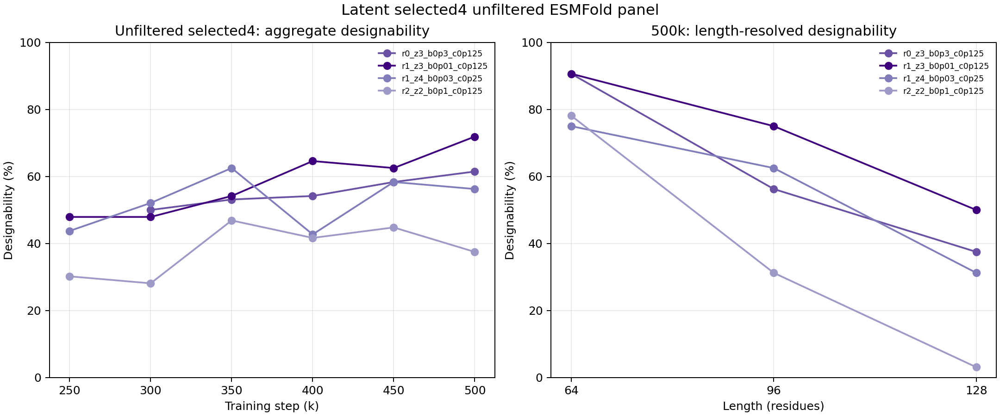

# Unfiltered selected4 latent run through 500k

## Decision summary

The unfiltered selected4 campaign did produce mature results. It is distinct from the length-256 campaign: this run evaluates lengths 64, 96, and 128, while the length-256 campaign was configured for lengths 64-256 but has no durable samples or ESMFold outputs at 400k-500k.

At 500k, `r1_z3_b0p01_c0p125` is strongest at 71.9% strict designability (69/96), followed by `r0_z3_b0p3_c0p125` at 61.5% (59/96), `r1_z4_b0p03_c0p25` at 56.3% (54/96), and `r2_z2_b0p1_c0p125` at 37.5% (36/96). Strict designability is CA RMSD < 2 A and mean ESMFold pLDDT > 80.

## Provenance and contract

| Field | Value |
| --- | --- |
| Campaign | `atom4-latent-selected4-500k` |
| Immutable source commit | `49b037f10a9916b6f8ad8bfc1da07928ff47411f` |
| Remote campaign root | `/mnt/lustre/users/kiarash-eitgbi/code/hierarchical-kaveh-runs/atom4-latent-selected4-500k/49b037f10a9916b6f8ad8bfc1da07928ff47411f` |
| ESMFold contract | Per-panel `panel_summary.json` plus PDBs |
| Completed checkpoints | 250k, 300k, 350k, 400k, 450k, 500k |
| Completed panels | 24 arm/checkpoint panels, 96 samples per panel |
| Exact quantitative artifact | [CSV](artifacts/latent_unfiltered_selected4_500k_esmfold.csv), 92 rows including 24 aggregate rows and 68 length cells |

## Aggregate panels

| Step | Arm | Designable | Mean CA RMSD (A) | Median CA RMSD (A) | Mean pLDDT | RMSD <2 | pLDDT >80 | Mean TM-like |
| ---: | --- | ---: | ---: | ---: | ---: | ---: | ---: | ---: |
| 250k | `r1_z3_b0p01_c0p125` | 46/96 (47.9%) | 1.655 | 1.088 | 77.71 | 78.1% | 47.9% | 0.875 |
| 250k | `r1_z4_b0p03_c0p25` | 42/96 (43.8%) | 2.048 | 1.224 | 78.84 | 77.1% | 52.1% | 0.863 |
| 250k | `r2_z2_b0p1_c0p125` | 29/96 (30.2%) | 3.089 | 1.309 | 71.20 | 72.9% | 31.2% | 0.783 |
| 300k | `r0_z3_b0p3_c0p125` | 48/96 (50.0%) | 1.529 | 0.930 | 79.06 | 86.5% | 52.1% | 0.893 |
| 300k | `r1_z3_b0p01_c0p125` | 46/96 (47.9%) | 2.674 | 1.053 | 78.07 | 83.3% | 50.0% | 0.853 |
| 300k | `r1_z4_b0p03_c0p25` | 50/96 (52.1%) | 1.620 | 0.989 | 80.61 | 85.4% | 57.3% | 0.895 |
| 300k | `r2_z2_b0p1_c0p125` | 27/96 (28.1%) | 2.875 | 1.163 | 73.23 | 69.8% | 33.3% | 0.786 |
| 350k | `r0_z3_b0p3_c0p125` | 51/96 (53.1%) | 1.504 | 1.017 | 79.64 | 87.5% | 55.2% | 0.900 |
| 350k | `r1_z3_b0p01_c0p125` | 52/96 (54.2%) | 1.829 | 1.106 | 80.13 | 82.3% | 60.4% | 0.877 |
| 350k | `r1_z4_b0p03_c0p25` | 60/96 (62.5%) | 1.646 | 1.041 | 81.11 | 83.3% | 65.6% | 0.891 |
| 350k | `r2_z2_b0p1_c0p125` | 45/96 (46.9%) | 3.022 | 1.166 | 76.37 | 72.9% | 49.0% | 0.780 |
| 400k | `r0_z3_b0p3_c0p125` | 52/96 (54.2%) | 1.576 | 0.978 | 80.00 | 84.4% | 56.2% | 0.888 |
| 400k | `r1_z3_b0p01_c0p125` | 62/96 (64.6%) | 1.305 | 0.984 | 81.12 | 88.5% | 67.7% | 0.906 |
| 400k | `r1_z4_b0p03_c0p25` | 41/96 (42.7%) | 1.956 | 1.084 | 77.20 | 80.2% | 46.9% | 0.866 |
| 400k | `r2_z2_b0p1_c0p125` | 40/96 (41.7%) | 2.158 | 1.182 | 76.36 | 80.2% | 44.8% | 0.840 |
| 450k | `r0_z3_b0p3_c0p125` | 56/96 (58.3%) | 1.398 | 1.001 | 80.64 | 84.4% | 60.4% | 0.902 |
| 450k | `r1_z3_b0p01_c0p125` | 60/96 (62.5%) | 1.901 | 0.930 | 80.15 | 85.4% | 64.6% | 0.882 |
| 450k | `r1_z4_b0p03_c0p25` | 56/96 (58.3%) | 1.368 | 0.931 | 80.98 | 88.5% | 62.5% | 0.905 |
| 450k | `r2_z2_b0p1_c0p125` | 43/96 (44.8%) | 3.138 | 1.275 | 73.15 | 72.9% | 49.0% | 0.777 |
| 500k | `r0_z3_b0p3_c0p125` | 59/96 (61.5%) | 1.473 | 0.930 | 80.31 | 85.4% | 64.6% | 0.896 |
| 500k | `r1_z3_b0p01_c0p125` | 69/96 (71.9%) | 1.317 | 0.825 | 82.44 | 93.8% | 72.9% | 0.920 |
| 500k | `r1_z4_b0p03_c0p25` | 54/96 (56.2%) | 1.524 | 0.986 | 80.27 | 84.4% | 60.4% | 0.892 |
| 500k | `r2_z2_b0p1_c0p125` | 36/96 (37.5%) | 3.644 | 1.361 | 70.97 | 59.4% | 40.6% | 0.741 |

## 500k length-resolved cells

| Arm | L64 | L96 | L128 |
| --- | ---: | ---: | ---: |
| `r0_z3_b0p3_c0p125` | 29/32 (90.6%) | 18/32 (56.2%) | 12/32 (37.5%) |
| `r1_z3_b0p01_c0p125` | 29/32 (90.6%) | 24/32 (75.0%) | 16/32 (50.0%) |
| `r1_z4_b0p03_c0p25` | 24/32 (75.0%) | 20/32 (62.5%) | 10/32 (31.2%) |
| `r2_z2_b0p1_c0p125` | 25/32 (78.1%) | 10/32 (31.2%) | 1/32 (3.1%) |

The full CSV retains each cell's arm, `constant_k3` sampling variant, checkpoint, length, sample count, designable count, designability, CA RMSD, pLDDT, RMSD pass rate, pLDDT pass rate, and TM-like score. The aggregate rows are included as separate records rather than replacing the cell-level data.

## Companion length-256 campaign status

| Stage | Training | Samples | ESMFold | Analysis |
| --- | --- | --- | --- | --- |
| 250k-350k | Durable outputs present | Durable outputs present | 12 panels complete | Completed panel analyses |
| 400k | `latest.pt`/metadata only; no checkpoint milestone file verified | 0 sample PDBs | 0 PDBs / 0 summaries | Launch scaffolding only |
| 450k-500k | Launch scaffolding only | 0 sample PDBs | 0 PDBs / 0 summaries | Launch scaffolding only |

This absence is an incomplete downstream pipeline, not evidence of poor foldability. The monitor should repair or relaunch the length-256 sampling gate before interpreting 400k-500k quality.
