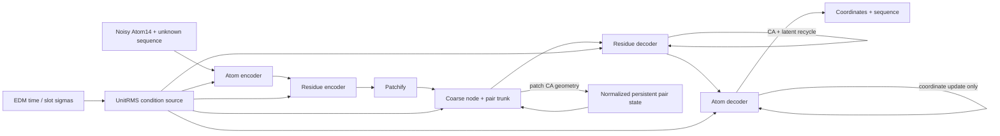

# Signal propagation and recycling redesign (2026-08-25)

Status: root causes identified; core fixes validated in short canaries; one
production trajectory is at 250k and continuing; adaptive modulation factorial
is active.

## Decision summary

The original recycling models were finite but internally unhealthy. Large
register and content activations, unbounded time modulation, saturated gates,
an unnormalized geometry shortcut, and persistent atom-latent recurrence let
the network solve its losses through badly scaled internal paths. Ordinary NaN
monitoring did not detect this.

The strongest validated changes are:

1. fix the node residual gauge with parameter-free post-residual UnitRMS;
2. normalize pair residuals and make recycled geometry update the persistent
   pair state instead of entering node attention through a direct shortcut;
3. use the actual patch slot sigmas for coarse EDM conditioning and losses;
4. normalize the shared condition source and separate recycled latent state
   from amino-acid logits;
5. reconstruct the atom traversal state at each decoder unit and accumulate
   only coordinates, following Pallatom's recurrence distinction;
6. use soft-start output initialization, per-head RMS Q/K normalization, and no
   learning-rate warmup;
7. use intermediate-supervision decay 0.8 rather than the nearly flat 0.99;
8. retain no registers as the current promoted engineering baseline while
   adaptive modulation is factorialized.

These changes fix the dominant measured pathologies. They do not yet prove
better final designability, and adaptive modulation remains the main unresolved
signal risk.

## Information flow and original failure routes

In the original model, attention residuals were added at full magnitude while
only FFN residuals were depth-scaled. Registers had no supervised semantic
target and became a low-cost residual sink. Recycled coarse geometry bypassed
the persistent pair-update machinery as a direct attention bias. Atom units
carried a learned atom representation forward and added coordinate and sequence
feedback to it, so latent magnitude and coordinate refinement became entangled.

Pallatom avoids the last two routes: recycled geometry enters its pair-update
path, and each atom unit rebuilds its representation from a fixed traversing
state plus normalized injections while only coordinate updates accumulate.

## Fully trained baseline audit

The first audit used four matched L128 sampling trajectories per checkpoint.
These are deterministic activation diagnostics, not confidence intervals.

| 400k model | Max register RMS | Max content RMS | First residue register RMS | Adaptive scale range | Max gate saturation | Max pair-bias/QK |
| --- | ---: | ---: | ---: | ---: | ---: | ---: |
| LR 3e-4, batch-256 control | 4,608 | 62.9 | 443 | -5.38 to 8.25 | 80.1% | 2.04 |
| LR 3e-4, batch-256 quadrature | 2,263 | 54.6 | 491 | -5.91 to 6.97 | 85.5% | 2.85 |
| LR 1e-3, batch-256 control | 37,622 | 2.99e15 | 1,027 | -4.00e6 to 3.82e6 | 100% | 129.61 |
| LR 1e-3, batch-256 quadrature | 1,387 | 701 | 451 | -7.56 to 9.62 | 97.5% | 2.49 |

The LR 3e-4 models were already in a poor BF16 regime: a stream near RMS 4,500
has percent-scale representational resolution, while many later register
updates were below one percent of the stream. The LR 1e-3 control remained
finite despite catastrophic scale growth, approximately zero learned residue
and atom feedback, and a pair bias 130 times QK. All LR 1e-3 trajectories were
therefore rejected; higher learning rate was not a useful regularizer.

The original adaptive normalization used `scale = 1 + modulation(condition)`.
It had no positivity or magnitude constraint. Negative scales were legal but
flipped features, and nothing prevented runaway time conditioning. Attention
output gates then saturated over 80% of channels, acting as a compensation
mechanism rather than a controlled residual path.

## Residual-gauge factorial

Workflow `hk-register-gauge-factorial-b256-4x5k-d13d4fd-v1` separated register
clock conditioning from post-residual UnitRMS. All 19 tasks succeeded and no
nonfinite values appeared.

| Arm | Register/content RMS at 5k | First-register FFN delta/input | Loss | Max adaptive bound fraction | Max gate saturation |
| --- | ---: | ---: | ---: | ---: | ---: |
| Control | 28.85 / 5.75 | 9.95x | 1.789 | 69.7% | 87.5% |
| Register clock only | 8.29 / 5.09 | 10.52x | 1.785 | 77.2% | 86.8% |
| Post-norm only | 1.00 / 1.00 | 0.63x | 1.794 | 75.7% | 84.9% |
| Combined | 1.00 / 1.00 | 0.67x | 1.799 | 76.6% | 89.8% |

Post-residual UnitRMS broke the visible residual-scale gauge without a material
throughput change (about 790 samples/s in the synchronized canary). Register
clock conditioning reduced register magnitude but did not fix branch
domination. The persistent adaptive-bound and gate saturation showed that
post-norm alone was not a complete causal fix.

## Core signal fixes and the hidden-path diagnosis

The first fixed model added node and pair UnitRMS, normalized injections,
consistent patch clocks, separated recycling latent from sequence logits, and
Pallatom-style atom traversal. Its node output RMS stayed exactly one, but the
internal register FFN and direct coarse geometry path still grew with training.

The follow-up changed intermediate loss decay from 0.99 to 0.8, scale-matched
register entry, and moved recycled geometry into the normalized persistent pair
state. The matched 20k and 100k audits show why that was a causal improvement:

| Model and step | Coarse geometry/pair | First-register FFN delta/input | Adaptive bound fraction | Gate saturation | Pair-bias/QK |
| --- | ---: | ---: | ---: | ---: | ---: |
| First fixed model, 20k | 1.77 | 57.59x | 65.9% | 4.9% | 1.26 |
| Pair-state + decay 0.8, 20k | **0.22** | **0.068x** | 55.9% | 5.5% | 1.73 |
| First fixed model, 100k | 2.58 | 105.59x | 84.1% | 20.5% | 2.58 |
| Pair-state + decay 0.8, 100k | **0.41** | **0.114x** | 81.2% | 25.8% | 3.48 |

Thus post-norm was not merely hiding the same problem after the pair-state
change: both oversized hidden routes fell by orders of magnitude. Adaptive
conditioning still presses against its bounds, and pair-bias/QK grows to 3.48
by 100k. Those are the remaining monitored risks.

## Short intervention decisions

All sample-derived values below use four deterministic L128 outputs and are
diagnostics only.

### Initialization: promote soft start, reject warmup

At 5k, soft start reduced pair-bias/QK from 1.42 to 1.28 and bad CA steps from
3.94% to 2.56% without branch domination. A 2k optimizer warmup reduced some
adaptive statistics but increased atom feedback/stream from 0.082 to 0.376 and
bad CA steps to 8.27%. Soft start was retained; warmup was not.

### Q/K normalization: promote per-head RMS, reject active-small gains

| 10k arm | Q/K head RMS CV | Pair-bias/QK | Gate saturation | Residual-gain saturation |
| --- | ---: | ---: | ---: | ---: |
| Control | 1.335 | 1.35 | 1.6% | 0% |
| Per-head RMS Q/K | **0.614** | **1.09** | 2.0% | 0% |
| Active-small | 1.358 | 2.39 | 49.9% | 87.3% |
| Active-small + per-head | 0.456 | 1.93 | 44.6% | 93.6% |

Per-head parameter-free RMS equalized heads without recreating gate
saturation. Learned active-small residual gains rapidly became another
saturated control surface and were rejected.

### Atom traversal and registers

Strict atom traversal made atom latent feedback exactly zero by construction.
At 10k it retained healthy sequence diversity and did not destabilize the
remaining feedback paths, so it was promoted.

Removing registers was neutral-to-favorable but not independently decisive.
In the final 2x2 promoted-package factorial, the no-register strict/per-head arm
had the lowest Q/K head RMS CV (0.405), pair-bias/QK 1.11, 43.0% adaptive-bound
fraction, zero atom latent feedback, effective alphabet 9.47, and 0.20% bad CA
steps. The four-sample screen cannot establish designability, but there was no
measured signal-propagation reason to keep semantically untargeted registers.
The current adaptive-modulation factorial therefore uses zero registers.

## Production trajectory

Workflow `hk-signal-pair-recycling-decay08-b256-400k-88331b6-v1` is a single
batch-256, LR 3e-4 trajectory. It trains from scratch to 350k and then resumes
exactly to 400k. Commit `88331b6ab9a37f19fed3c6338583c06f456743c3`
contains the resumable launcher; the model changes originate in the preceding
signal-fix commits.

Corrected Atom37-masked quality summaries currently exist through 250k:

| Step | Strict L128 | Mean CA RMSD (A) | Mean pLDDT | BB clashes/res | O-BB clashes/res | Bad CA steps | Eff. alphabet | Ala |
| ---: | ---: | ---: | ---: | ---: | ---: | ---: | ---: | ---: |
| 20k | 0.0% | 9.40 | 46.3 | 0.092 | 0.085 | 0.00% | 9.26 | 25.5% |
| 50k | 0.0% | 6.80 | 53.3 | 0.063 | 0.062 | 0.00% | 9.27 | 29.2% |
| 100k | 3.1% | 5.06 | 59.3 | 0.077 | 0.074 | 0.00% | 8.64 | 31.9% |
| 150k | 6.2% | 3.87 | 65.1 | 0.069 | 0.069 | 0.00% | 8.56 | 30.8% |
| 200k | 12.5% | 4.52 | 67.0 | 0.059 | 0.058 | 0.00% | 8.15 | 32.0% |
| 250k | 9.4% | 3.39 | 69.6 | 0.057 | 0.056 | 0.01% | 7.90 | 34.5% |

These are point estimates from 32 matched samples, not bootstrap intervals.
Only pLDDT sourced from `pdb_atom37_masked_b_factors` is accepted. The reused
analysis script labels its Markdown as a coarse-relative-position campaign;
the directory and arm provenance above are authoritative.

As of 2026-08-25, checkpoints exist through 250k and training is still active.
The trajectory shows improving foldability and backbone sterics, but also a
falling effective alphabet and rising alanine fraction. It is not yet a final
promotion result.

## Pallatom comparison

The installed Pallatom code uses:

- LayerNorm without affine parameters on the content input;
- a normalized condition vector;
- sigmoid adaptive scale plus an additive shift;
- condition-dependent sigmoid gates on attention and FFN outputs, initialized
  with bias -2;
- pair-mediated geometry recycling;
- a nonpersistent atom representation across refinement units.

The Kaveh redesign has already adopted the last two structural principles.
The normalization and output-gate choices are being tested rather than copied
blindly because Pallatom's sigmoid scale starts near 0.5, whereas Kaveh's
bounded RMS modulation is identity-initialized and preserves RMS rather than
mean and variance.

## Active adaptive-modulation factorial

Workflow `hk-signal-adaptive-modulation-b256-6x10k-4258fc2-v1` at commit
`4258fc24f7c24669007c48c0f39dc5bf2f3f81fc` tests six matched arms:

| Normalization | Without output gate | With adaptive attention/FFN output gate |
| --- | --- | --- |
| Bounded RMS, total scale in [0.25, 4] | `bounded` | `bounded_gate` |
| Factorized static x conditional RMS, same total bound | `factorized` | `factorized_gate` |
| Pallatom LayerNorm + sigmoid scale + shift | `pallatom` | `pallatom_gate` |

Every arm uses batch 256, no registers, per-head RMS Q/K, strict atom traversal,
soft-start initialization, no warmup, no active-small gains, full recycling,
intermediate decay 0.8, and the 50% `Uniform(0, 5 A)` quadrature training
mixture. The optional output gates are independent condition-only sigmoid gates
with zero weights and bias -2 (initial gain about 0.119).

Remote tests passed and all six trainers are active. No 1k/5k/10k audit has
completed at the time of this entry, so none of the three adaptive norms or the
output gate is promoted.

## Provenance and evidence rules

- Fully trained audit:
  `recycling-feature-magnitude-audit-400k/7f15be8921bf59906625ccb15018afcd526163f3/v1`.
- Register-gauge factorial: commit `d13d4fd`, steps 1k and 5k.
- First production signal-fix continuation: commit `720be68`, audits at 20k
  and 100k.
- Pair-state/decay-0.8 production model: commit `88331b6`, audits at 20k and
  100k, corrected quality through 250k.
- Short interventions: `5bb01bb` (initialization), `ba0fe08` (active-small and
  Q/K), `c06f85f` (registers and atom traversal), and `73f48ff` (combined 2x2).
- Adaptive-modulation factorial: commit `4258fc2`.
- Activation audits use four deterministic matched samples; quality panels use
  their stated sample counts. Neither is a confidence interval unless a
  bootstrap interval is explicitly reported.
