# Hierarchical Kaveh information flow

This diagram follows `HierarchicalKaveh.forward` and the module implementations in
`hierarchical_kaveh/model/network.py`, `attention.py`, `pair.py`, and `patch.py`.
Repeated blocks are shown once with their loop depth.

```mermaid
flowchart TB
    %% -------------------- Inputs and conditioning --------------------
    input["DenoiserInput\ncoordinates [B,N,14,3]\nsigma, masks, residue/chain metadata\naatype_input, optional self-conditioned coordinates"]
    validate["validate + prefix masks\natom_mask, residue_mask"]
    edm["EDM input scaling\nc_in * raw_coordinates"]
    sigma["sigma -> log-noise embedding -> time FFN\nresidue_condition [B,N,C]"]
    input --> validate
    input --> edm
    input --> sigma

    residue_in["ResidueInput\naatype one-hot + chain-break feature\nmasked residue stream R0"]
    layout["chain-aware p=4 PatchLayout\nresidue<->patch/slot maps, masks, segment indices"]
    validate --> residue_in
    input --> residue_in
    validate --> layout
    input --> layout

    %% -------------------- Atom encoder --------------------
    atom_input["AtomInput\nscaled coordinates + optional self-conditioning\n+ residue stream + time condition"]
    atom_enc["Atom encoder\n[AtomBlock] x atom_encoder_depth\nlocal Atom14 attention within residue-index window\n+ conditioned GEGLU FFN"]
    atom_skip["atom_skip"]
    atom_to_res["AtomToResidue\nlearned masked pooling + explicit mean residual"]
    atom_update["pad atom update to N residues"]
    residue_after_atom["R1 = R0 + atom_update"]
    edm --> atom_input
    input --> atom_input
    residue_in --> atom_input
    sigma --> atom_input
    layout --> atom_input
    atom_input --> atom_enc --> atom_skip
    atom_skip --> atom_to_res --> atom_update --> residue_after_atom
    residue_in --> residue_after_atom

    %% -------------------- Global residue encoder and patchification --------------------
    registers0["4 learned registers"]
    residue_tokens["registers + R1\nresidue condition, mask, integer positions"]
    residue_enc["Global residue encoder\n[GlobalBlock] x residue_encoder_depth\nglobal RoPE attention + conditioned FFN"]
    residue_skip["residue_skip\nfinal residue encoder stream"]
    residue_after_atom --> residue_tokens
    registers0 --> residue_tokens
    sigma --> residue_tokens
    residue_tokens --> residue_enc --> residue_skip

    patchify["Patchify (p=4)\nmasked learned pooling + exact mean residual\npatches P-node features + patch_condition"]
    residue_skip --> patchify
    layout --> patchify
    sigma --> patchify

    %% -------------------- Persistent pair initialization --------------------
    ca["raw C-alpha coordinates\nslot-packed by PatchLayout"]
    pair_init["PairInitializer\nstatic topology: signed-log separation, chain identity, validity\ngeometry: ordered 4x4 CA distances -> RBFs\nP0 [B,M,M,pair_dim]"]
    input --> ca --> pair_init
    layout --> pair_init

    coarse_tokens["coarse_x0 = 4 registers + patches\ncoarse condition/mask/positions"]
    registers0 --> coarse_tokens
    patchify --> coarse_tokens
    sigma --> coarse_tokens
    layout --> coarse_tokens

    %% -------------------- Coarse trunk --------------------
    subgraph COARSE["Coarse p=4 trunk: CoarseBlock repeated coarse_depth times"]
        direction TB
        xl["X_l: coarse node/register states"]
        pl["P_l: persistent patch-pair state"]

        subgraph NODE["Node branch: pair-biased attention then FFN"]
            direction LR
            qkv["RMSNorm(X_l) -> Q,K,V\nQ/K LayerNorm + patch RoPE"]
            pair_bias["LayerNorm(P_l) -> linear(pair_dim, heads)\n2x scale; embed as patch-patch entries\nregister rows/cols receive zero bias"]
            biased_attn["attention\nsoftmax(QK^T / sqrt(head_dim) + pair_bias + mask) V\nCUDA: fused FA3 pair-bias kernel\nreference: dense SDPA-equivalent path"]
            node_gate["conditioned sigmoid gate + zero-init output projection"]
            x_attn["X_l + attention_update"]
            x_next["conditioned FFN\nX_(l+1)"]
            qkv --> biased_attn
            pair_bias --> biased_attn
            biased_attn --> node_gate --> x_attn --> x_next
        end

        subgraph PAIR["Pair branch: outgoing then incoming multiplication"]
            direction LR
            pair_in["P_l\n(shared input with pair-bias projection)"]
            outgoing["Outgoing multiplication\nLN -> gated L,R\nU_ij = sum_k L_ik * R_jk\n/sqrt(valid degree) -> projection + output gate"]
            out_res["gated residual\nP_l + alpha_out * U"]
            incoming["Incoming multiplication\nLN -> gated L,R\nU_ij = sum_k L_ki * R_kj\n/sqrt(valid degree) -> projection + output gate"]
            pair_next["gated residual\nP_(l+1) = P_out + alpha_in * U"]
            pair_in --> outgoing --> out_res --> incoming --> pair_next
        end

        xl --> qkv
        pl --> pair_bias
        pl --> pair_in
        x_next -. "next block node input" .-> xl
        pair_next -. "next block pair input" .-> pl
    end

    coarse_tokens --> xl
    pair_init --> pl
    coarse_out_x["coarse_xL"]
    coarse_out_p["PL"]
    x_next --> coarse_out_x
    pair_next --> coarse_out_p

    %% -------------------- Residue decoder and atom decoder --------------------
    unpatch["Unpatchify\nslot-aware coarse patch update + saved residue_skip"]
    coarse_out_x --> unpatch
    residue_skip --> unpatch
    residue_after_coarse["residue stream after coarse update"]
    unpatch --> residue_after_coarse

    decoder_tokens["4 coarse registers + residue stream"]
    coarse_out_x --> decoder_tokens
    residue_after_coarse --> decoder_tokens
    sigma --> decoder_tokens
    residue_dec["Global residue decoder\n[GlobalBlock] x residue_decoder_depth\nglobal RoPE attention + conditioned FFN"]
    decoder_tokens --> residue_dec
    residue_final["final residue representations"]
    residue_dec --> residue_final

    atom_inject["AtomOutput.inject\natom_skip + projected final residue + slot embedding"]
    atom_dec["Atom decoder\n[AtomBlock] x atom_decoder_depth\nlocal Atom14 attention + conditioned FFN"]
    atom_final["final atom representations"]
    atom_skip --> atom_inject
    residue_final --> atom_inject
    atom_inject --> atom_dec --> atom_final

    coord_head["coordinate head\nraw_update = linear(LN(atom_final))\nEDM combine: c_skip * raw_coordinates + c_out * raw_update"]
    seq_head["sequence head\nLN + linear/ReLU, mean over valid atoms\n20-way amino-acid logits"]
    edm --> coord_head
    input --> coord_head
    atom_final --> coord_head
    atom_final --> seq_head

    dist_head["DistogramHead\nLayerNorm -> GEGLU -> patch-pair logits\ncompact patch distogram; optional dense expansion"]
    coarse_out_p --> dist_head

    outputs["Outputs\npredicted coordinates\naamino-acid logits\noptional compact distogram"]
    coord_head --> outputs
    seq_head --> outputs
    dist_head --> outputs

    %% -------------------- Styling --------------------
    classDef input fill:#eef2ff,stroke:#4f46e5,color:#111827
    classDef state fill:#ecfdf5,stroke:#059669,color:#111827
    classDef pair fill:#fff7ed,stroke:#ea580c,color:#111827
    classDef output fill:#fdf2f8,stroke:#db2777,color:#111827
    class input,validate,edm,sigma,layout,ca,residue_in input
    class atom_skip,residue_skip,residue_after_atom,residue_final,coarse_out_x,coarse_out_p,atom_final state
    class pl,pair_init,pair_bias,pair_in,outgoing,out_res,incoming,pair_next,coarse_out_p,dist_head pair
    class outputs,coord_head,seq_head output
```

## What happens in the coarse block?

Yes. Every coarse block uses **both** pair-biased attention and pair
multiplication, but they are separate branches with a specific ordering:

1. The incoming pair state `P_l` is projected through `LayerNorm(pair)` and a
   linear map from `pair_dim` to `attention_heads`. The result is multiplied by
   `2.0` and placed into the patch-to-patch part of the full attention-bias
   matrix. Register-to-anything entries are zero; the ordinary attention mask
   still controls valid tokens.
2. The node state `X_l` produces `Q`, `K`, and `V`. Attention uses
   `softmax(QK^T / sqrt(d) + pair_bias + mask)V`, followed by a conditioned gate
   and a residual update to the node state.
3. The same **incoming** `P_l` is independently sent to outgoing triangle
   multiplication. Its gated left/right projections are contracted over the
   intermediate patch index, normalized by the square root of the valid degree,
   projected, output-gated, and added as a learned-scaled residual.
4. The resulting pair state is then sent to incoming triangle multiplication,
   which performs the second contraction and another learned-scaled gated
   residual, producing `P_(l+1)`.

The node FFN runs after node attention, while pair multiplication runs on the
pair branch. There is no node-to-pair update inside the block, so the node
update does not alter the pair state used by that block's pair multiplications.
The updated pair state first becomes the attention bias in the **next** coarse
block. There is also no triangle-attention module in this repository.

## Source anchors

- Coarse block ordering: `hierarchical_kaveh/model/pair.py:285-318`
- Pair-bias projection and attention equation: `hierarchical_kaveh/model/pair.py:117-180`
- Outgoing/incoming contractions: `hierarchical_kaveh/model/pair.py:183-282`
- Coarse-loop wiring: `hierarchical_kaveh/model/network.py:273-327`
- Patch/pair initialization: `hierarchical_kaveh/model/patch.py:149-191` and
  `hierarchical_kaveh/model/pair.py:18-80`
